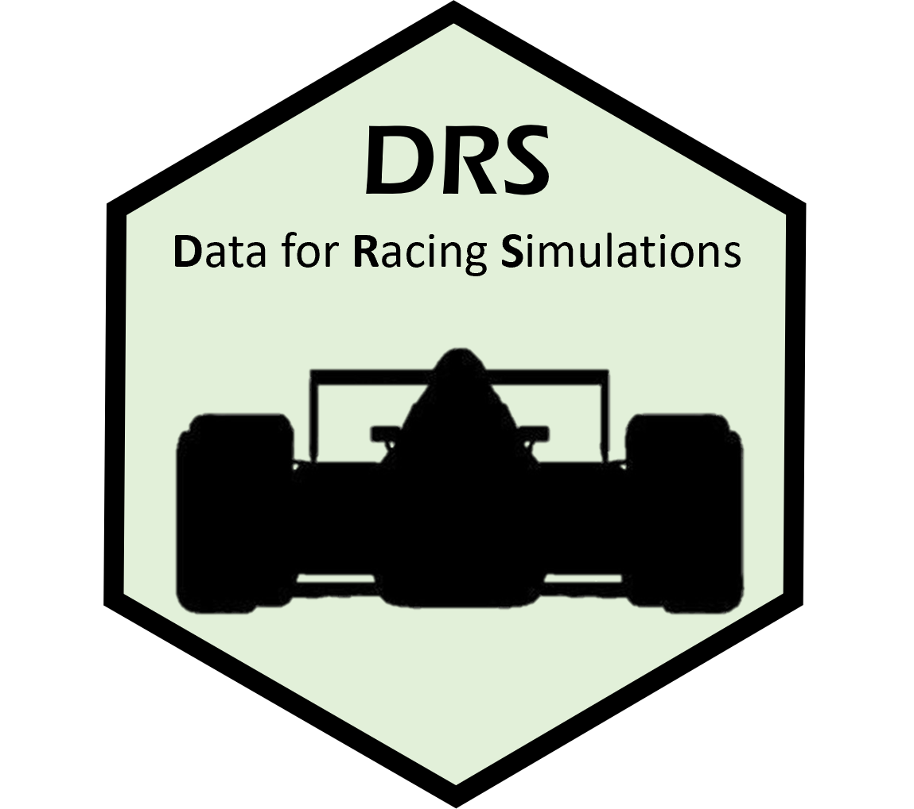

```{r, include = FALSE}
knitr::opts_chunk$set(
  collapse = TRUE,
  comment = "#>",
  fig.path = "man/figures/README-",
  out.width = "100%"
)
```




<br />
<br />
<br />

# DRS
<br />
<br />


**drs** is an R package that utilizes functions from **rvest** and **dplyr** to scrape and tidy data from the formula1.com website. It is designed to scrape data for all Grand Prix weekends during a given year. A Grand Prix weekend consists of practice sessions, qualifying, and a race. Additionally, some weekends will also include a sprint race (an abbreviated sprint race that is typically about 1/3 the length of a normal race). 

A typical Formula 1 weekend begins with three practice sessions. The first two practice sessions (FP1 and FP2) are held on Friday. On Saturday, the third practice session (FP3) is held, followed by Qualifying. Qualifying determines the grid for the race on Sunday. Currently, there are three heats in qualifying (Q1, Q2, and Q3). All cars compete in the first heat (*Q1*), and the top 15 fastest times advance to the 2nd heat, *Q2*. From there, the top 10 fastest times during heat 2 advance to *Q3* (heat 3). The starting grid is determined by a driver's final qualifying position (sans penalties). The race takes place on Sunday.  

**drs** currently consists of four scraping functions:

* `practice_session_scraper()`: Scrapes the best times for a given practice session. 
* `qualifying_scraper()`: Scrapes the best qualifying times during Q1, Q2, and Q3. 
* `starting_grid_scraper()`: Scrapes the final starting grid positions for the Grand Prix. 
* `race_result_scraper()()`: Scrapes the race results for a Grand Prix (i.e. finishing position and total time). 

<br />


## Installation

You can install the development version of **drs** here:

``` r
install_github("/casanscott/drs")
```

## Examples

These functions from **drs** require both the **tidyverse** and **rvest** packages. The `practice_session_scraper()` requires two arguments: `year` and `practice_session_number`. After loading those libraries, along with **drs**, you can easily scrape data using a function call like this: 

```{r example practice, warning = F, message= F}
library(tidyverse)
library(rvest)
library(drs)

# pull FP3 practice data
p32022 <- practice_session_scraper(2022, 3)

# View the first 6 rows
head(p32022)
```


The rest of the **drs** web scraping functions require a single argument: `year`. 

The following function will scrape all qualifying results from 2022: 

```{r example qualifying, warning = F, message= F}

# pull qualifying data
quali2022 <- qualifying_scraper(2022)

# View the first 6 rows
head(quali2022)
```


To scrape the starting grids for every Grand Prix during 2022, use the following function call:

```{r example starting grid, warning = F, message= F}

# pull starting grids
grids2022 <- starting_grid_scraper(2022)

# View the first 6 rows
head(grids2022)
```


To scrape the race results for every Grand Prix during 2022, use the following function call:

```{r example race results, warning= F, message= F}

# Pull race results
races2022 <- race_result_scraper(2022)

# View the first 6 rows
head(races2022)
```


