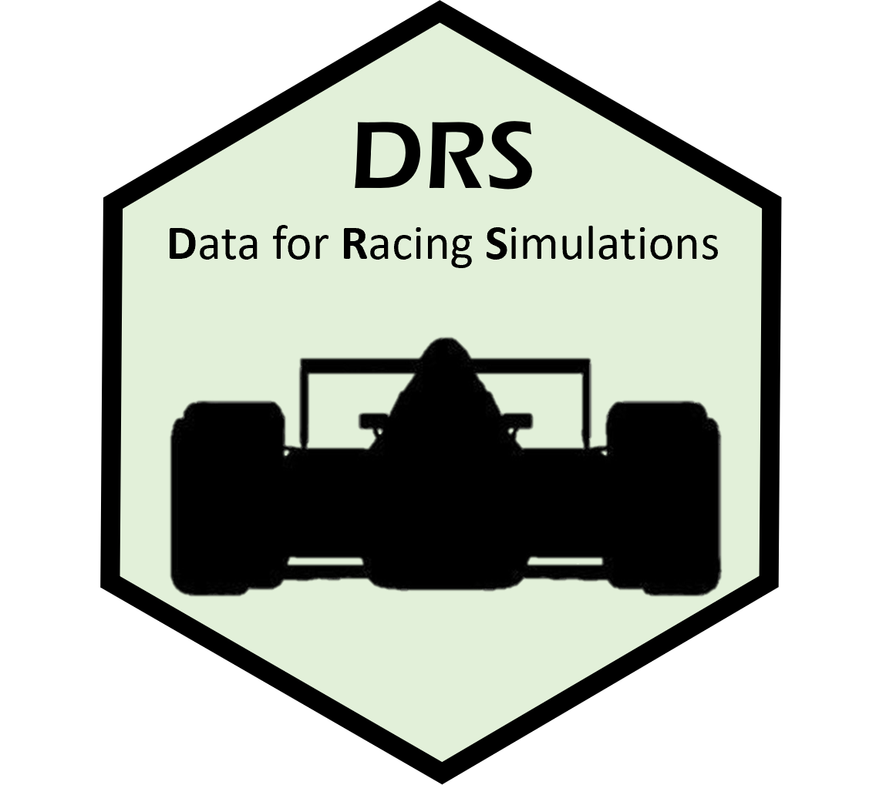

<br /> <br /> <br />

# DRS

<br />

The **drs** package is intended to be used by Formula 1 fans who are
would like to explore, plot, or model data from the formula1.com
website.

<br />

## Installation

You can install the development version of drs like so:

``` r
https://github.com/casanscott/drs
```

## Examples

To scrape the starting grids for every Grand Prix during 2022, use the
following function call:

``` r
library(drs)

# starting_grid_scraper(2022)
```

To scrape the race results for every Grand Prix during 2022, use the
following function call:

``` r

# race_result_scraper(2022)
```
